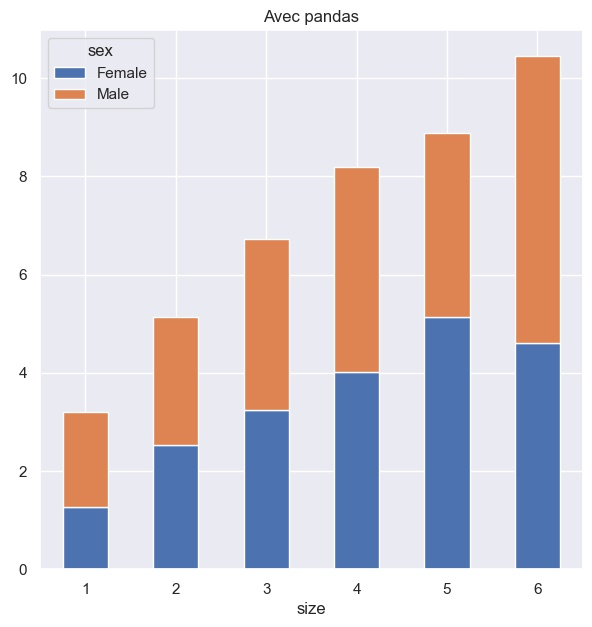

<style>
.python{
    background-color: gold !important;
}

pre {
  white-space: pre-wrap;
  box-shadow: 10px 5px 5px lightblue;
}
</style>


## Contenu du document

On presente dans les slides suivantes les graphiques usuels en R avec *ggplot2* et *patchwork*, et en Python avec *seaborn*, *matplotlib* et *pandas*.

Prerequis pour produire cette presentation **xaringan** avec Rstudio :

- une distribution Python (Anaconda convient tres bien)
- le package R *reticulate* qui permet d'utiliser des objets R dans des chunks Python (syntaxe *r.mon_objet_r*) et inversement (syntaxe *py$mon_objet_python*)


```{r setup, include=FALSE}
knitr::opts_chunk$set(echo = TRUE, 
                      fig.show = "hold", 
                      fig.align='center', 
                      results = "hold", 
                      message = FALSE, 
                      warning = FALSE, 
                      comment = "", 
                      #cache = TRUE,
                      out.width = '400px',
	                    out.height = '300px')
```


---

## Chargement des packages et donnees

.pull-left[
```{r packages_dtf, message=FALSE}
library("dplyr")

library("ggplot2")
# pour centrer les titres des graphiques ggplot2
theme_update(plot.title = element_text(hjust = 0.5))

# pour la grille de graphiques
library("patchwork")

dtf = reshape2::tips %>% group_by(size, sex) %>% summarise(tip = mean(tip)) %>% ungroup
dir.create("images")

library("reticulate")
# chemin vers l'executable python
use_python("C:/Users/Sebastien/Anaconda3/python.exe")
```


```{python, echo=FALSE}
# pour regler un bug graphique assez courant avec Anaconda, 
# adapter le chemin vers le dossier 'plugins/platforms'
import os
os.environ['QT_QPA_PLATFORM_PLUGIN_PATH'] = 'C:/Users/Sebastien/Anaconda3/Library/plugins/platforms'

# Et le format 'xaringan' n'affiche pas les graphiques Python directement --> on triche un peu
#   1. On affiche le code qui devrait marcher mais on ne l'execute pas
#   2. On execute, mais sans l'afficher, le code et l'export de l'image en local
#   3. On recharge l'image locale dans le document sans afficher le code
```


```{python}
import matplotlib.pyplot as plt
import seaborn as sns
sns.set()
```
]


---

## Les donnees

.pull-left[
<p style="text-align:center">`r fontawesome::fa('r-project', fill = 'blue', height = '60px')`</p>
```{r}
dtf
```
]

.pull-right[
<p style="text-align:center">`r fontawesome::fa('python', fill = 'gold', height = '60px')`</p>
```{python}
dtf = r.dtf; dtf.head(4)
```

```{python}
dtf_transposees = dtf.pivot(index='size', columns='sex', values='tip'); dtf_transposees.head(4)
```
]


---

## Courbes

.pull-left[
<p style="text-align:center">`r fontawesome::fa('r-project', fill = 'blue', height = '60px')`</p>
```{r, out.width = '450px', out.height='350px'}
ggplot(dtf, aes(size, tip, col = sex)) + geom_line()
```
]

.pull-right[
<p style="text-align:center">`r fontawesome::fa('python', fill = 'gold', height = '60px')`</p>
```{python,eval = FALSE}
sns.lineplot(x="size", y="tip", hue="sex", data=dtf)
plt.show()
```

```{python, echo = FALSE}
g = sns.lineplot(x = "size", y = "tip", hue="sex", data=dtf)
plt.savefig("images/courbes.jpg", bbox_inches  ='tight')
plt.close()
```

```{r, echo = FALSE}

```
]


---

## Nuage de points

.pull-left[
<p style="text-align:center">`r fontawesome::fa('r-project', fill = 'blue', height = '60px')`</p>
```{r}
ggplot(dtf, aes(size, tip, col = sex)) + geom_point()
```
]

.pull-right[
<p style="text-align:center">`r fontawesome::fa('python', fill = 'gold', height = '60px')`</p>
```{python,eval = FALSE}
sns.scatterplot(x="size", y="tip", hue="sex", data=dtf)
# ou : sns.lmplot("size", "tip", hue="sex", data=dtf)
plt.show()
```

```{python, echo = FALSE}
g = sns.scatterplot(x = "size", y = "tip", hue="sex", data=dtf)
plt.savefig("images/nuage.jpg", bbox_inches  ='tight')
plt.close()
```

```{r, echo = FALSE}

```
]


---

## Pavage hexagonal

.pull-left[
<p style="text-align:center">`r fontawesome::fa('r-project', fill = 'blue', height = '60px')`</p>
```{r}
ggplot(dtf, aes(size, tip)) + geom_hex(bins = 6)
```
]

.pull-right[
<p style="text-align:center">`r fontawesome::fa('python', fill = 'gold', height = '60px')`</p>
```{python,eval = FALSE}
plt.hexbin(dtf['size'], dtf['tip'], gridsize=(5,5), cmap="Blues")
plt.xlabel("size"); plt.ylabel("tip"); plt.title("Avec matplotlib"); plt.colorbar(); plt.show()
```

```{python, echo = FALSE}
g = plt.hexbin(dtf['size'], dtf['tip'], gridsize=(5,5), cmap="Blues")
a = plt.xlabel("size"); b = plt.ylabel("tip"); c = plt.title("Avec matplotlib"); d = plt.colorbar()
plt.savefig("images/pavage.jpg", bbox_inches  ='tight')
plt.close()
```

```{r, echo = FALSE}

```
]


---

## Diagramme en barres groupees

.pull-left[
<p style="text-align:center">`r fontawesome::fa('r-project', fill = 'blue', height = '60px')`</p>
```{r}
ggplot(dtf, aes(size, tip, fill = sex)) + geom_col(position = "dodge")
```
]

.pull-right[
<p style="text-align:center">`r fontawesome::fa('python', fill = 'gold', height = '60px')`</p>
```{python,eval = FALSE}
sns.barplot(x="size", y="tip", hue="sex", data=dtf)
plt.show()
```

```{python, echo = FALSE}
g = sns.barplot(x="size", y="tip", hue="sex", data=dtf)
plt.savefig("images/barplot_groupe.jpg", bbox_inches  ='tight')
plt.close()
```

```{r, echo = FALSE}

```
]


---

## Diagramme en barres empilees

.pull-left[
<p style="text-align:center">`r fontawesome::fa('r-project', fill = 'blue', height = '60px')`</p>
```{r}
ggplot(dtf, aes(size, tip, fill = sex)) + geom_col()
```
]

.pull-right[
<p style="text-align:center">`r fontawesome::fa('python', fill = 'gold', height = '60px')`</p>
```{python,eval = FALSE}
dtf_transposees.plot.bar(stacked="True", rot = 0)
plt.title("Avec pandas"); plt.show()
```

```{python, echo = FALSE}
g = dtf_transposees.plot.bar(stacked="True", rot = 0)
a = plt.title("Avec pandas")
plt.savefig("images/barplot_empilees.jpg", bbox_inches  ='tight')
plt.close()
```

```{r, echo = FALSE}

```
]


---

## Histogramme

.pull-left[
<p style="text-align:center">`r fontawesome::fa('r-project', fill = 'blue', height = '60px')`</p>
```{r}
ggplot(dtf, aes(tip)) + geom_histogram(bins = 4)
```
]

.pull-right[
<p style="text-align:center">`r fontawesome::fa('python', fill = 'gold', height = '60px')`</p>
```{python,eval = FALSE}
dtf.tip.hist(bins = 4) # ou : sns.distplot(dtf.tip)
plt.title("Avec pandas"); plt.show()
```

```{python, echo = FALSE}
g = dtf.tip.hist(bins = 4)
a = plt.title("Avec pandas")
plt.savefig("images/histo.jpg", bbox_inches  ='tight')
plt.close()
```

```{r, echo = FALSE}

```
]


---

## Courbes de densite

.pull-left[
<p style="text-align:center">`r fontawesome::fa('r-project', fill = 'blue', height = '60px')`</p>
```{r}
ggplot(dtf, aes(tip, fill= sex)) + geom_density(alpha= 0.4)
```
]

.pull-right[
<p style="text-align:center">`r fontawesome::fa('python', fill = 'gold', height = '60px')`</p>
```{python,eval = FALSE}
sns.kdeplot(data= dtf, x= 'tip', hue= 'sex', shade= True)
plt.show()
```

```{python, echo = FALSE}
g = sns.kdeplot(data = dtf, x = 'tip', hue = 'sex', shade = True)
plt.savefig("images/densite.jpg", bbox_inches  ='tight')
plt.close()
```

```{r, echo = FALSE}

```
]


---

## Boxplots

.pull-left[
<p style="text-align:center">`r fontawesome::fa('r-project', fill = 'blue', height = '60px')`</p>
```{r}
ggplot(dtf, aes(sex, tip, fill = sex)) + geom_boxplot()
```
]

.pull-right[
<p style="text-align:center">`r fontawesome::fa('python', fill = 'gold', height = '60px')`</p>
```{python,eval = FALSE}
sns.boxplot(x="sex", y="tip", data=dtf)
plt.show()
```

```{python, echo = FALSE}
g = sns.boxplot(x="sex", y="tip", data=dtf)
plt.savefig("images/boxplots.jpg", bbox_inches  ='tight')
plt.close()
```

```{r, echo = FALSE}

```
]


---

## Faceting

.pull-left[
<p style="text-align:center">`r fontawesome::fa('r-project', fill = 'blue', height = '60px')`</p>
```{r}
ggplot(dtf, aes(size, tip))+geom_line()+facet_grid(. ~ sex)
```
]

.pull-right[
<p style="text-align:center">`r fontawesome::fa('python', fill = 'gold', height = '60px')`</p>
```{python,eval = FALSE}
sns.FacetGrid(dtf,col="sex").map(sns.lineplot,"size","tip")
plt.show()
```

```{python, echo = FALSE}
g = sns.FacetGrid(dtf, col="sex").map(sns.lineplot, "size", "tip")
plt.savefig("images/facettes.jpg", bbox_inches  ='tight')
plt.close()
```

```{r, echo = FALSE}

```
]


---

## Grille

.pull-left[
<p style="text-align:center">`r fontawesome::fa('r-project', fill = 'blue', height = '60px')`</p>
```{r, out.width = '550px'}
ggplot(dtf, aes(size, tip, col = sex)) + geom_point() + ggtitle("nuage") | 
  ggplot(dtf, aes(size, tip, fill = sex)) + geom_col(position = "dodge") + ggtitle("barres")
```
]

.pull-right[
<p style="text-align:center">`r fontawesome::fa('python', fill = 'gold', height = '60px')`</p>
```{python,eval = FALSE}
f, axes = plt.subplots(1, 2, figsize=(15, 10))
axes[0].set_title('nuage');axes[1].set_title('barres')
sns.barplot(x='size',y='tip',hue='sex',data=dtf,ax=axes[0])
sns.scatterplot(x='size',y='tip',hue='sex',data=dtf,ax=axes[1])
plt.show()
```

```{python, echo = FALSE}
f, axes = plt.subplots(1, 2, figsize=(15, 10))
a = axes[0].set_title('nuage')
b = axes[1].set_title('barres')
g = sns.barplot(x='size',y='tip',hue='sex',data=dtf,ax=axes[0])
h = sns.scatterplot(x="size", y="tip", hue="sex", data=dtf,  ax=axes[1])
plt.savefig("images/grille.jpg", bbox_inches  ='tight')
plt.close()
```

```{r, echo = FALSE, out.height='250px',}

```
]

